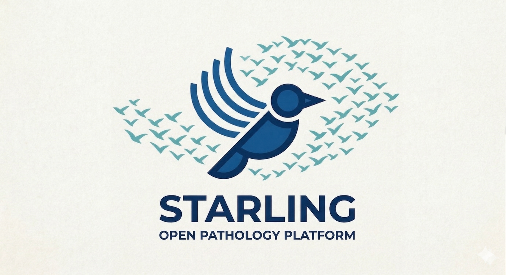

<div align="center">
  
</div>

Okapi is a cloud-native platform designed to modernize Anatomic Pathology workflows by bridging the gap between hospital Laboratory Information Systems (LIS) and advanced AI decision support tools.

---

## 🎯 Purpose

Okapi serves as the "Orchestration Kernel" that enables:
-   **AI-Assisted Diagnostics**: Seamlessly integrating AI suggestions into the pathologist's workflow.
-   **Interoperability**: Connecting on-premise hospital networks (Traditional AP LIS, Cerner) with cloud-hosted utilities via HL7/FHIR.
-   **Clinical Decision Support (CDS)**: Automating routine tasks to reduce burnout and error rates.

## 🗺️ Repository Structure

This repository is organized into functional modules and regulatory documentation:

| Directory | Description |
|-----------|-------------|
| **[`auth-system/`](auth-system/README.md)** | **Authentication Service**<br>The Identity & Access Management backend. Handles OIDC/SAML login, Identity Normalization, and RBAC.<br>_Tech: Java 25, Spring Boot 3.5, Keycloak, Postgres_ |
| **[`qms/`](qms/dhf/00-Index.md)** | **Quality Management System**<br>Contains the Design History File (DHF) and Standard Operating Procedures (SOPs) required for regulated medical software.<br>_Includes: Requirements (SRS), Design (SDS), Risk Management_ |

## 🚀 Getting Started

The project is currently focused on the Authentication foundation.

1.  Navigate to the Auth System:
    ```bash
    cd auth-system
    ```
2.  Follow the [Auth System README](auth-system/README.md) to start the local development environment (Docker + Keycloak + Postgres).

### Demo provisioning (dev)

If you want a fully working local demo with:
- demo users/groups in Keycloak, and
- normalized identities populated in Okapi/Postgres,

see:
- `auth-system/README.md` (end-to-end local run + Admin seeding endpoint)
- `seed/README.md` (seed datasets + Keycloak seeding script)

## 📜 Quality & Compliance

Okapi follows a strict Quality Management System (QMS) compliant with medical software standards.

-   **Design History File**: Start with the [DHF Index](qms/dhf/00-Index.md) to understand the system definition.
-   **Contributing**: All changes must follow the [Git Contribution Workflow (SOP-DocControl)](qms/sops/SOP-DocControl.md).
