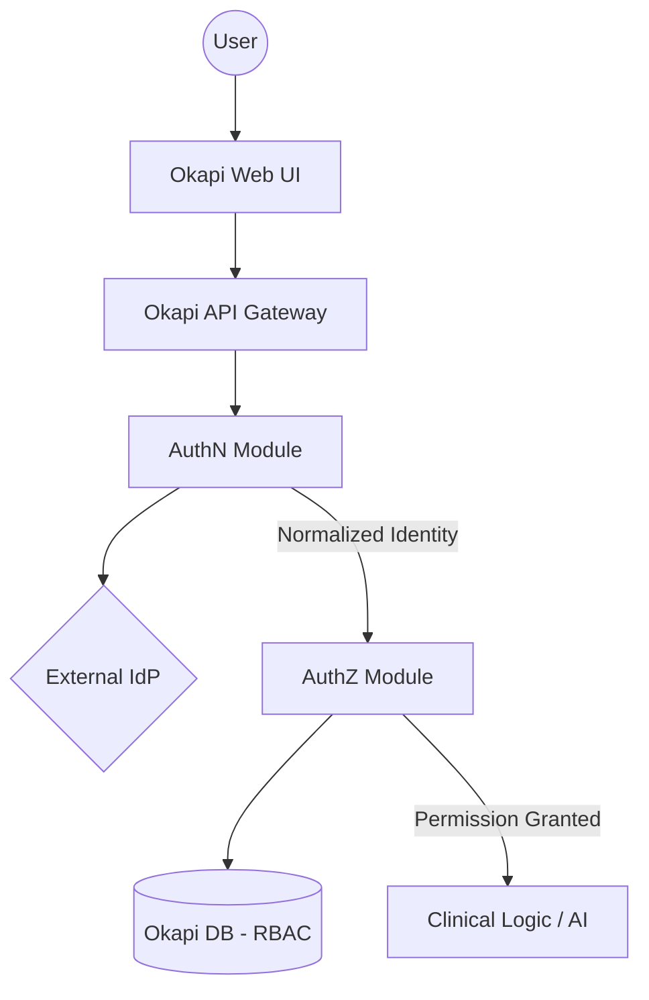

# 04-SDS

---
title: Software Design Specification
document_id: DHF-04
version: 1.0
status: DRAFT
owner: Lead Architect
created_date: 2026-01-09
trace_source: SRS-001
---

# 1. Introduction

This Software Design Specification (SDS) describes the technical architecture and design for the Okapi system, with a focus on the Identity and Access Management (IAM) framework. To ensure a clear separation of concerns, the system distinguishes between **Authentication (AuthN)**—the proof of identity—and **Authorization (AuthZ)**—the determination of permissions.

# 2. Architectural Overview

Okapi follows a "Connector + Normalization" architecture for identity.
- **AuthN** is delegated to external Enterprise Identity Providers (IdPs).
- **AuthZ** is managed internally within Okapi using Role-Based Access Control (RBAC).

# 3. Authentication (AuthN) Design

## 3.1 Protocol Handling
Okapi acts as a Service Provider (SAML 2.0) and an OIDC Client.

- **OIDC (OpenID Connect):** Used for modern cloud IdPs (Okta, Entra ID, Auth0).
- **SAML 2.0:** Used for hospital enterprise SSO (e.g., YNHH).

## 3.2 Identity Normalization
The AuthN Gateway maps various IdP claims into a stable internal `Identity` object:

| Field | Source | Description |
| :--- | :--- | :--- |
| `external_subject` | `sub` (OIDC) or `NameID` (SAML) | Stable unique identifier. |
| `issuer` | `iss` or EntityID | The source IdP. |
| `display_name` | `name` or `displayName` | User's full name. |
| `email` | `email` | User's institutional email. |

## 3.3 Session Management
- **Local Session:** Established via a secure, HTTP-only cookie after successful IdP callback.
- **Duration:** Default 12-hour session (adjustable per site policy).
- **Logout:** Local logout clears the Okapi session; federated logout is best-effort.

# 4. Authorization (AuthZ) Design

## 4.1 Role-Based Access Control (RBAC)
Okapi manages permissions via Roles. Each authenticated user is mapped to one or more roles.

| Role | Permissions |
| :--- | :--- |
| `Pathologist` | View cases, create AI suggestions, confirm results, write-back to Epic. |
| `Technician` | View cases, manage data ingestion. |
| `Admin` | Manage system configuration, view audit logs. |

## 4.2 Role Mapping
Okapi supports mapping IdP groups (e.g., SAML `memberOf`) to internal Roles via configuration, allowing central management of clinical permissions.

# 5. Component Boundaries

# 6. Audit and Security Controls

- **Audit Logging:** All AuthN events (success/fail/logout) and AuthZ denials are logged to immutable storage.
- **Fail Closed:** Any failure in token validation or IdP communication results in immediate denial of access.
- **No Local Secrets:** All IdP client secrets and certificates are managed via AWS Secrets Manager or environment variables.

# 7. Traceability

| Design Element | System Requirement | Risk Control |
| :--- | :--- | :--- |
| AuthN Gateway (OIDC/SAML) | SYS-AUTH-001, SYS-AUTH-002 | RISK-001 |
| Session Token (12hr) | SYS-AUTH-004 | N/A |
| Immutable Audit Logs | SYS-AUD-001 | RISK-006 |
| RBAC Enforcement | SYS-AUTH-003 | RISK-005 |