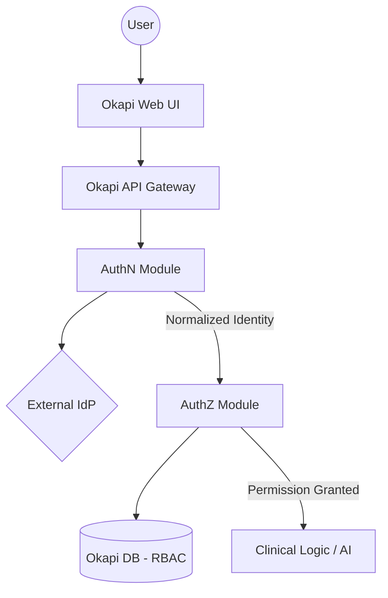

# 04-SDS

---
title: Software Design Specification
document_id: DHF-04
version: 1.0
status: DRAFT
owner: Lead Architect
created_date: 2026-01-09
trace_source: SRS-001
---

# 1. Introduction

This Software Design Specification (SDS) describes the technical architecture and design for the Okapi system, with a focus on the Identity and Access Management (IAM) framework. To ensure a clear separation of concerns, the system distinguishes between **Authentication (AuthN)**—the proof of identity—and **Authorization (AuthZ)**—the determination of permissions.

# 2. Architectural Overview

Okapi follows a "Connector + Normalization" architecture for identity.
- **AuthN** is delegated to external Enterprise Identity Providers (IdPs).
- **AuthZ** is managed internally within Okapi using Role-Based Access Control (RBAC).

# 3. Authentication (AuthN) Design

## 3.1 Protocol Handling
Okapi acts as a Service Provider (SAML 2.0) and an OIDC Client.

- **OIDC (OpenID Connect):** Used for modern cloud IdPs (Okta, Entra ID, Auth0).
- **SAML 2.0:** Used for hospital enterprise SSO (e.g., YNHH).

## 3.2 Identity Normalization
The AuthN layer maps various IdP claims into a stable internal `Identity` object and persists a normalized identity record.

| Field | Source | Description |
| :--- | :--- | :--- |
| `external_subject` | `sub` (OIDC) or `NameID` (SAML) | External subject identifier. |
| `provider_id` | `iss` (OIDC) or EntityID (SAML) | Provider/issuer identifier; uniqueness is scoped to provider. |
| `display_name` | `name` or IdP-provided display attribute | User's display name (full). |
| `display_short` | IdP-provided display attribute | User's short display name (e.g., "Family, G.M.") for compact UI surfaces. |
| `given_name` / `family_name` | OIDC `given_name` / `family_name` (if provided) | Structured components to support clinical formatting and disambiguation. |
| `email` | `email` | User's institutional email. |

The system also provides an authenticated identity introspection endpoint ("who am I") to support UI integration and operational troubleshooting:
- `GET /auth/me` returns the current normalized identity summary (provider ID, subject, display name/email when available, and derived roles/authorities).

## 3.3 Session Management
- Session establishment and cookie properties are handled by Spring Security.
- Session duration and “remember device” behavior are defined in SRS and will be validated in VVP (implementation may evolve).

# 4. Authorization (AuthZ) Design

## 4.1 Role-Based Access Control (RBAC)
Okapi manages permissions via Roles. Each authenticated user is mapped to one or more roles.

| Role | Permissions |
| :--- | :--- |
| `Pathologist` | View cases, create AI suggestions, confirm results, write-back to Epic. |
| `Technician` | View cases, manage data ingestion. |
| `Admin` | Manage system configuration, view audit logs. |

## 4.2 Role Mapping
Okapi supports mapping IdP groups (e.g., OIDC `groups`, SAML `memberOf`) to internal Roles via database mappings. Mappings are **issuer-scoped** to avoid cross-IdP collisions.

### 4.2.1 Administrative access management
- Okapi does **not** create primary user credentials.
- Administrative capability is derived from centralized IdP group membership (e.g., `Okapi_Admins`) and mapped to the internal `ADMIN` role.
- Okapi manages local authorization policy via issuer-scoped mappings and local permission assignments (e.g., permission groups).

This approach reduces manual configuration error and supports timely access provisioning for clinical users.

## 4.3 Authorization Data Model (summary)
- Schema management is owned by Flyway migrations under `auth-system/src/main/resources/db/migration/`.
- Baseline reference data (roles and IdP group mappings) is seeded via Flyway; sample identities are not seeded in baseline migrations.

# 5. Component Boundaries

# 6. Audit and Security Controls

- **External AuthN:** Okapi delegates authentication to external IdPs (no password storage).
- **Fail Closed:** Invalid tokens or missing auth context yields `401/403`.
- **Audit foundation:** The database includes an `audit_events` table; event emission and downstream immutability controls are verified per VVP.
- **No committed secrets:** IdP and DB secrets are supplied via environment variables / secret store (dev uses `.env`, gitignored).

# 7. Traceability

| Design Element | System Requirement | Risk Control |
| :--- | :--- | :--- |
| AuthN Gateway (OIDC/SAML) | SYS-AUTH-001, SYS-AUTH-002 | RISK-001 |
| Issuer-scoped identity normalization | SYS-AUTH-006 | RISK-009 |
| RBAC enforcement via group→role mapping | SYS-AUTH-004, SYS-AUTH-009 | RISK-010 |
| Flyway-managed schema + baseline seed | SYS-DATA-003 | RISK-012 |
| Audit event schema + event emission plan | SYS-AUD-002 | RISK-006 |