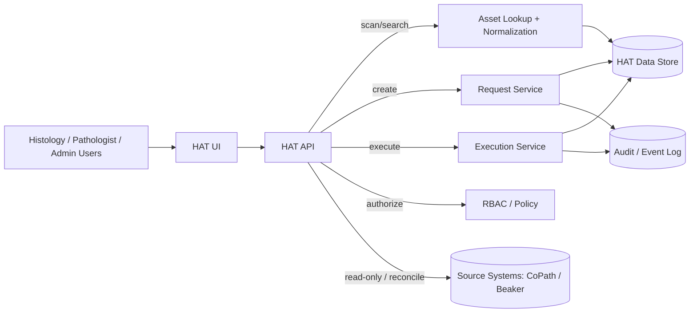

# 04-HAT-Architecture

---
title: Histology Asset Tracking (HAT) Architecture
document_id: DHF-04-04
version: 0.1
status: DRAFT
owner: Lead Architect
created_date: 2026-01-11
trace_source: SRS-001
---

## 1. Purpose
Define the software design for the Histology Asset Tracking (HAT) module, including component boundaries, data concepts, and security-relevant design decisions.

## 2. Core design principle: Facts vs Intent/Work

HAT explicitly separates:

1) **Asset facts (state)** — what the system knows about an asset:
- identifiers and crosswalks (barcode/raw/normalized, LIS IDs, external consult IDs)
- **current** status/location/custody (single authoritative view)
- provenance (who/which system asserted the state)
- append-only history/events

2) **Intent/work (requests + execution)** — what someone wants done and how staff executes it:
- requests/tickets describing required actions, priority/due date, assignee/team
- per-asset execution steps (scan-confirmed)
- completion evidence (e.g., tracking number, destination, receipt/return)

This seam is required for:
- safe scan-first workflows (`SYS-HAT-001`, `SYS-HAT-009`)
- traceability (`SYS-HAT-005`, `SYS-HAT-014`)
- reconciliation across sources (`SYS-HAT-012`)

## 3. High-level architecture

## 4. Data model (conceptual)

### 4.1 Asset identity and crosswalk
Key concepts:
- **Asset**: a physical slide/block/specimen part.
- **Identifier**: each asset can have multiple identifiers (raw barcode string, normalized barcode, LIS identifiers, external IDs).

Design intent:
- support deterministic lookup outcomes: matched / not found / ambiguous (`SYS-HAT-002`)
- preserve both raw and normalized forms for explainability and reconciliation (`UN-HAT-001`)

### 4.2 Current state vs event history
HAT maintains:
- a **current state projection** for instant lookup (`SYS-HAT-004`, performance)
- an **append-only event log** for defensibility (`SYS-HAT-005`)

Non-destructive corrections are represented as new events that supersede previous assertions without deleting history (`SYS-HAT-006`).

### 4.3 Requests and execution
A request encodes intent:
- requested action(s) (pull, stain, QA, distribute, scan, etc.)
- priority and due date
- requester identity (internal user or external contact)
- assignee (team/person)

Execution records milestones as events (pulled, stained, QA, packaged, shipped) with completion evidence (`SYS-HAT-010`).

Partial fulfillment is first-class (some assets complete, some missing/substituted) (`SYS-HAT-008`).

### 4.4 Reconciliation and provenance
When source systems disagree (orchestration kernel vs LIS vs physical), HAT requires explicit conflict recording and resolution events with provenance and human attribution (`SYS-HAT-012`).

## 5. Security and governance

### 5.1 RBAC and high-risk actions
- HAT endpoints and UI actions are role-gated (`SYS-HAT-013`).
- High-risk actions (external distribution, research release) require stronger controls (policy-defined approvals, mandatory evidence fields, audit).

### 5.2 Privacy-limited search
Search capabilities must be constrained per site policy:
- default accession-based workflows when PHI search is restricted
- audit access to sensitive fields

This aligns to `SYS-HAT-003`.

## 6. Traceability summary

| Design Element | System Requirement |
|---|---|
| Identifier normalization + deterministic lookup | `SYS-HAT-001`, `SYS-HAT-002` |
| Current-state projection + provenance | `SYS-HAT-004` |
| Append-only history + corrections | `SYS-HAT-005`, `SYS-HAT-006` |
| Requests (intent) + lifecycle | `SYS-HAT-007`, `SYS-HAT-008` |
| Execution milestones + evidence | `SYS-HAT-009`, `SYS-HAT-010` |
| Placeholder assets + reconciliation | `SYS-HAT-011`, `SYS-HAT-012` |
| RBAC + governance | `SYS-HAT-013`, `SYS-HAT-014` |
